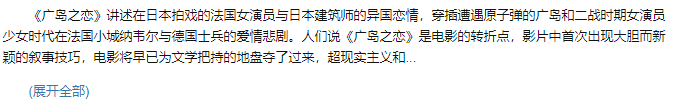

# 实验1-stage1实验报告

**毛陈诚 PB20111694**

### 爬虫方式与运用工具

- 采取网页爬取

- 爬虫工具使用了python的beautiful soup库用来解析 HTML。

- selenium的webdriver库用来驱动浏览器,完全模拟浏览器的行为

### **反爬措施与应对策略**

1. **对请求Headers进行限制**

   直接使用requests库对相应URL发送请求，会被拒绝访问。本次实验调用了selenium的webdriver库，模拟chrome浏览器对网页进行访问

   ```
   from selenium import webdriver
   driver = webdriver.Chrome()
   ```

2. **对频繁访问ip进行身份验证**

   使用IP代理池，通过ip代理，从不同的ip进行访问。

   **本次实验的ip代理池来源于https://github.com/jhao104/proxy_pool**

   - 采用docker的redis容器来存放代理IP的数据库URI，配置格式为: `db_type://[[user]:[pwd]]@ip:port/[db]`.

   - 该代理池启动后， `server` 后会提供http接口，在代码中可以通过封装上面的API接口来使用代理,代码如下：

     ```
         def get_proxy(Any):
             return requests.get("http://127.0.0.1:5010/get/").json()
             
         def delete_proxy(proxy,Any):
             requests.get("http://127.0.0.1:5010/delete/?proxy={}".format(proxy))
             
        	def getHtml(self,url):
             retry_count = 5
             proxy = self.get_proxy().get("proxy")
             chromeOptions.add_argument("--proxy-server=http://"+proxy)
             browser = webdriver.Chrome(chrome_options = chromeOptions)
             while retry_count > 0:
                 try:
                     self.driver.get(url)
                     # 使用代理访问
                     html = self.driver.page_source
                     return html
                 except Exception:
                     retry_count -= 1
             # 删除代理池中代理
             self.delete_proxy(proxy)
             return None
     ```

     

### **网页解析方法**

**以电影解析为例**

采用`beautifulsoap`库解析网页，用csv中的`dictwiter`库把所获得的数据存储入.csv文件

利用chrome的开发者工具获取网页的`html`代码，找到要爬取项目对应的代码，左键复制selector元素便可得到元素所属的层次，依据此可调用`beuatifulsoap`的`find`库函数对`soup`类文件解析得到对应项目

1. 获取网页`soup`类文件

   ```
   html = self.getHtml(page_url)
   while(html == None):
   html = self.getHtml(page_url)
   page_soup = BeautifulSoup(html,features='lxml')
   ```

2. 解析标题

   ```python
   movie_titles = page_soup.find('div',{'id':'wrapper'})
   title = movie_titles.h1.span.string##title : #wrapper > h1 > span
   ```

3. 解析评分，作者

   ```python
   ##interest_sectl > div > div.rating_self.clearfix > strong
   book_rating = page_soup.find('div',{'class':'rating_selfclearfix'})
   rating =  book_rating.strong.get_text();
   ##info > span:nth-child(1) > a
   author = page_soup.find('div',{'id':'info'}).select('span')[0].a
   ```

4. 解析电影,作者梗概

   这里豆瓣梗概存在折叠与非折叠两种情况，它们处在不同的标头下，要分开讨论(下图里**展开全部**项)

   

   ```python
               book_summary = page_soup.find('div',{'id':'link-report'})
               summary = ""
               if book_summary.find('span',{'class':'all hidden'}) is not None:
                   for string in book_summary.find('span',{'class':'all hidden'}).stripped_strings:
                       summary += string #link-report > span.all.hidden > div > div > p
               elif book_summary.find('span',{'class':'short'}) is not None:
                    #link-report > span.short > div > p:nth-child(1)
                   for string in book_summary.find('span',						{'class':'short'}).stripped_strings:
                       summary += string;
               else:
                   #link-report > div > div > p
                   for string in book_summary.stripped_strings:
                       summary += string
   ```

   


